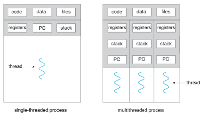
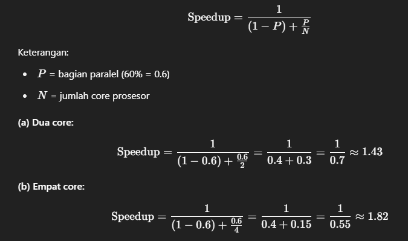

# Konsep Threading dan Implementasinya
**Oleh:** [Khoirul Yardan Mauluddin Zhorif 3124521022 TI A PSDKU LA]

## Daftar Isi
- [Konsep Single Thread dan Multithread](#konsep-single-thread-dan-multithread)
- [Implementasi Threading](#implementasi-threading)
  - [Java Fork/Join Framework (SumTask.java)](#java-forkjoin-framework-sumtaskjava)
  - [POSIX Threading di Linux (thrd-posix.c)](#posix-threading-di-linux-thrd-posixc)
  - [Win32 Threading di Windows (thrd-win32.c)](#win32-threading-di-windows-thrd-win32c)
- [PPT EVOLUSI TEKNOLOGI](#PPT-EVOLUSI-TEKNOLOGI)
- [Practice Exercises Chapter4](#Practice-Exercises-Chapter4)
## Konsep Single Thread dan Multithread

## 
<p align="center">
  
</p>

### Single Thread
Single Thread adalah model eksekusi di mana program menjalankan satu proses dalam satu waktu. Semua tugas dilakukan secara berurutan, sehingga jika satu tugas memerlukan waktu lama, seluruh program akan menunggu hingga tugas tersebut selesai. Model ini sederhana dan mudah diimplementasikan, namun kurang efisien untuk aplikasi yang memerlukan banyak operasi simultan.

### Multithread
Multithread adalah model eksekusi di mana program dapat menjalankan beberapa proses secara bersamaan dalam satu waktu. Setiap proses disebut sebagai "thread", dan mereka dapat berjalan secara paralel, memungkinkan program untuk melakukan banyak tugas secara efisien. Model ini meningkatkan kinerja, terutama pada sistem dengan banyak inti prosesor, namun memerlukan manajemen yang lebih kompleks untuk menghindari konflik antar thread.

## Implementasi Threading

### Java Fork/Join Framework (SumTask.java)

```java
/**
 * Fork/join parallelism in Java
 *
 * Figure 4.18
 *
 * @author Gagne, Galvin, Silberschatz
 * Operating System Concepts  - Tenth Edition
 * Copyright John Wiley & Sons - 2018
 */

import java.util.concurrent.*;

public class SumTask extends RecursiveTask<Integer>
{
    static final int SIZE = 10000;
    static final int THRESHOLD = 1000;

    private int begin;
    private int end;
    private int[] array;

    public SumTask(int begin, int end, int[] array) {
        this.begin = begin;
        this.end = end;
        this.array = array;
    }

    protected Integer compute() {
        if (end - begin < THRESHOLD) {
            // conquer stage
            int sum = 0;
            for (int i = begin; i <= end; i++)
                sum += array[i];

            return sum;
        }
        else {
            // divide stage
            int mid = begin + (end - begin) / 2;

            SumTask leftTask = new SumTask(begin, mid, array);
            SumTask rightTask = new SumTask(mid + 1, end, array);

            leftTask.fork();
            rightTask.fork();

            return rightTask.join() + leftTask.join();
        }
    }

    public static void main(String[] args) {
        ForkJoinPool pool = new ForkJoinPool();
        int[] array = new int[SIZE];

        // create SIZE random integers between 0 and 9
        java.util.Random rand = new java.util.Random();

        for (int i = 0; i < SIZE; i++) {
            array[i] = rand.nextInt(10);
        }

        // use fork-join parallelism to sum the array
        SumTask task = new SumTask(0, SIZE-1, array);

        int sum = pool.invoke(task);

        System.out.println("The sum is " + sum);
    }
}
```

#### Penjelasan Fork/Join Parallelism pada SumTask.java

Kode SumTask.java menggunakan Fork/Join Framework untuk menerapkan multithreading dalam menghitung jumlah seluruh elemen dari sebuah array. Pendekatan ini membagi tugas besar menjadi beberapa tugas kecil (divide and conquer), lalu menjalankannya secara paralel menggunakan thread.

**Tahapan Kerja:**
1. **Divide:**
   - Jika panjang array dari indeks `begin` ke `end` lebih besar dari `THRESHOLD` (1000), tugas dibagi dua: bagian kiri (`begin` ke `mid`) dan kanan (`mid+1` ke `end`).
   - Dua sub-tugas baru dibuat: `leftTask` dan `rightTask`.

2. **Fork:**
   - Kedua tugas tersebut dijalankan secara paralel dengan memanggil `.fork()`. Ini memberi tahu ForkJoinPool agar mengeksekusi sub-task di thread terpisah.

3. **Join:**
   - Setelah fork, hasil sub-tugas diambil dengan `.join()` dan dijumlahkan untuk memberikan hasil akhir.

4. **Conquer:**
   - Jika ukuran array lebih kecil dari `THRESHOLD`, penjumlahan dilakukan secara langsung (tanpa pembagian lebih lanjut).

**Konteks Threading:**
- Kelas `SumTask` mewarisi `RecursiveTask<Integer>` — artinya, ini adalah tugas yang akan mengembalikan nilai bertipe Integer.
- `ForkJoinPool` secara otomatis mengatur thread pool dan membagi tugas ke berbagai worker thread di balik layar.

**Kesimpulan:**
Dengan ForkJoinPool, program ini dapat memanfaatkan banyak inti CPU untuk memproses array besar secara efisien. Ini adalah bentuk multithreaded programming tingkat tinggi yang mudah dikelola dan scalable di Java.

### POSIX Threading di Linux (thrd-posix.c)

```c
/**
 * A pthread program illustrating how to
 * create a simple thread and some of the pthread API
 * This program implements the summation function where
 * the summation operation is run as a separate thread.
 *
 * Most Unix/Linux/OS X users
 * gcc thrd.c -lpthread
 *
 * Figure 4.11
 *
 * @author Gagne, Galvin, Silberschatz
 * Operating System Concepts  - Tenth Edition
 * Copyright John Wiley & Sons - 2018
 */

#include <pthread.h>
#include <stdio.h>
#include <stdlib.h>

int sum; /* this data is shared by the thread(s) */

void *runner(void *param); /* the thread */

int main(int argc, char *argv[])
{
    pthread_t tid; /* the thread identifier */
    pthread_attr_t attr; /* set of attributes for the thread */

    if (argc != 2) {
        fprintf(stderr,"usage: a.out <integer value>\n");
        /*exit(1);*/
        return -1;
    }

    if (atoi(argv[1]) < 0) {
        fprintf(stderr,"Argument %d must be non-negative\n",atoi(argv[1]));
        /*exit(1);*/
        return -1;
    }

    /* get the default attributes */
    pthread_attr_init(&attr);

    /* create the thread */
    pthread_create(&tid,&attr,runner,argv[1]);

    /* now wait for the thread to exit */
    pthread_join(tid,NULL);

    printf("sum = %d\n",sum);
}

/**
 * The thread will begin control in this function
 */
void *runner(void *param)
{
    int i, upper = atoi(param);
    sum = 0;

    if (upper > 0) {
        for (i = 1; i <= upper; i++)
            sum += i;
    }

    pthread_exit(0);
}
```

#### Penjelasan Penerapan Thread di Linux (thrd-posix.c)

Kode ini merupakan contoh sederhana penggunaan POSIX thread untuk menjalankan operasi penjumlahan angka dari 1 hingga n di dalam thread terpisah. Tujuannya adalah untuk menjalankan fungsi tertentu di thread yang berbeda dari thread utama (main thread).

**Struktur Program:**
1. **Deklarasi Thread & Atribut:**
   - `pthread_t tid;` digunakan untuk menyimpan ID dari thread yang akan dibuat.
   - `pthread_attr_t attr;` menyimpan atribut default dari thread.

2. **Validasi Input:**
   - Program menerima satu argumen berupa angka.
   - Dicek apakah angka valid (bukan negatif), lalu dikonversi ke integer.

3. **Inisialisasi & Pembuatan Thread:**
   - `pthread_attr_init(&attr);` mengambil atribut default.
   - `pthread_create(&tid, &attr, runner, argv[1]);` membuat thread baru yang menjalankan fungsi `runner()`.

4. **Sinkronisasi:**
   - `pthread_join(tid, NULL);` menunggu sampai thread selesai dieksekusi sebelum melanjutkan ke bagian printf.

5. **Fungsi runner():**
   - Fungsi inilah yang dijalankan dalam thread terpisah.
   - Mengonversi parameter menjadi int, lalu menjumlahkan bilangan dari 1 sampai n dan menyimpannya di variabel global `sum`.

**Konteks Threading:**
- Ini adalah multithreading manual: programmer harus menangani atribut, membuat thread, dan menyinkronkannya dengan join.
- Variabel `sum` bersifat shared memory, artinya dapat diakses oleh thread manapun — karena itu, dalam kasus yang kompleks perlu proteksi (misalnya mutex), tapi tidak diperlukan di contoh ini karena hanya satu thread bekerja dengan `sum`.

**Kesimpulan:**
Program ini menunjukkan bagaimana thread dapat digunakan untuk menjalankan tugas tambahan secara paralel dengan thread utama, meskipun dalam contoh ini thread utama hanya menunggu hasil dari thread runner(). Ini adalah dasar dari multithreading berbasis POSIX standard di Linux.

### Win32 Threading di Windows (thrd-win32.c)

```c
/**
 * This program creates a separate thread using the CreateThread() system call.
 *
 * Figure 4.13
 *
 * @author Gagne, Galvin, Silberschatz
 * Operating System Concepts  - Tenth Edition
 * Copyright John Wiley & Sons - 2018
 */

#include <stdio.h>
#include <windows.h>


DWORD Sum; /* data is shared by the thread(s) */

/* the thread runs in this separate function */
DWORD WINAPI Summation(PVOID Param)
{
    DWORD Upper = *(DWORD *)Param;

    for (DWORD i = 0; i <= Upper; i++)
        Sum += i;

    return 0;
}


int main(int argc, char *argv[])
{
    DWORD ThreadId;
    HANDLE ThreadHandle;
    int Param;

    // do some basic error checking
    if (argc != 2) {
        fprintf(stderr,"An integer parameter is required\n");
        return -1;
    }

    Param = atoi(argv[1]);

    if (Param < 0) {
        fprintf(stderr, "an integer >= 0 is required \n");
        return -1;
    }

    // create the thread
    ThreadHandle = CreateThread(NULL, 0, Summation, &Param, 0, &ThreadId);

    if (ThreadHandle != NULL) {
        WaitForSingleObject(ThreadHandle, INFINITE);
        CloseHandle(ThreadHandle);
        printf("sum = %d\n",Sum);
    }
}
```

#### Penjelasan Penerapan Thread di Microsoft Windows (thrd-win32.c)

Kode ini menunjukkan bagaimana sistem operasi Windows menangani pembuatan thread menggunakan API khusus Windows, yaitu `CreateThread()`. Fungsinya mirip dengan `pthread_create()` di Linux, namun dengan sintaks dan pendekatan yang berbeda.

**Struktur Program:**
1. **Deklarasi Variabel:**
   - `DWORD Sum;` adalah variabel global yang menyimpan hasil penjumlahan, bisa diakses oleh semua thread.
   - `DWORD ThreadId;` menyimpan ID thread yang dibuat.
   - `HANDLE ThreadHandle;` digunakan untuk mengelola thread yang sedang berjalan.
   - `int Param;` menyimpan batas atas penjumlahan.

2. **Validasi Input:**
   - Program menerima satu parameter input dari command line.
   - Dicek apakah input valid dan ≥ 0.

3. **Membuat Thread:**
   - `CreateThread(NULL, 0, Summation, &Param, 0, &ThreadId);` membuat sebuah thread baru.
   - `Summation()` adalah fungsi yang akan dijalankan secara paralel oleh thread ini.
   - Parameter `&Param` dikirim ke fungsi `Summation()` sebagai nilai batas penjumlahan.

4. **Sinkronisasi dan Output:**
   - `WaitForSingleObject(ThreadHandle, INFINITE);` memastikan thread utama menunggu hingga thread Summation selesai dieksekusi.
   - Setelah thread selesai, `CloseHandle(ThreadHandle);` menutup handle untuk melepaskan resource.
   - Hasil `Sum` ditampilkan ke layar.

5. **Fungsi Thread Summation():**
   - Fungsi ini akan dijalankan oleh thread baru.
   - Melakukan penjumlahan dari 0 sampai Upper dan menyimpan hasilnya di variabel `Sum`.

**Konteks Threading:**
- Pendekatan Windows menggunakan `CreateThread()` dari Windows API, berbeda dari POSIX.
- Fungsi `Summation()` bertipe `DWORD WINAPI` dan menerima parameter bertipe `PVOID` (generic pointer), sesuai konvensi thread di Windows.
- Tidak digunakan mutex atau synchronization primitive karena hanya satu thread menulis ke `Sum`, dan tidak ada race condition.

**Kesimpulan:**
Program ini adalah contoh dasar bagaimana menjalankan sebuah fungsi dalam thread terpisah di Windows. Sistem operasi Windows menyediakan kontrol lebih rendah (low-level) melalui `CreateThread()`, memungkinkan pemrograman multithread dengan cara manual, dibandingkan pendekatan high-level seperti di Java.

### PPT EVOLUSI TEKNOLOGI
[PPT Evolusi Teknologi](Evolusiteknologi.pdf)

### Practice Exercises Chapter4

# 📘 Tugas: Multithreading dan Amdahl's Law

## 4.1
### ✅ Tiga Contoh Pemrograman di mana Multithreading Memberikan Performa Lebih Baik Dibandingkan Single-Threaded

1. **Web Server Menangani Banyak Permintaan Klien**  
   Web server multithreaded dapat menangani banyak permintaan secara bersamaan, sehingga meningkatkan responsivitas dan throughput dibandingkan server single-threaded.

2. **Perkalian Matriks Paralel**  
   Operasi perkalian matriks besar dapat dibagi ke beberapa thread untuk menghitung baris atau kolom secara paralel, sehingga menghemat waktu komputasi secara signifikan.

3. **Pemrosesan atau Rendering Video**  
   Proses encoding atau rendering frame video dapat dibagi ke banyak thread untuk mempercepat proses dibandingkan jika dilakukan secara berurutan.

---

## 4.2
### ✅ Hitung Keuntungan Speedup dengan Hukum Amdahl
Dengan menggunakan Hukum Amdahl, hitunglah percepatan (speedup) dari sebuah aplikasi yang memiliki 60% komponen paralel untuk:

(a) Dua core prosesor

(b) Empat core prosesor

**Rumus Hukum Amdahl:**
<p align="center">
  
</p>
---

## 4.3
### ✅ Apakah Web Server Multithreaded Menunjukkan Paralelisme Tugas atau Data?

Jawaban: **Paralelisme Tugas (Task Parallelism)**  
Setiap thread menangani permintaan klien yang berbeda, yang berarti tiap thread menjalankan tugas yang berbeda secara bersamaan, bukan operasi yang sama pada data yang berbeda.

---

## 4.4
### ✅ Dua Perbedaan antara User-Level Threads dan Kernel-Level Threads & Kapan Lebih Baik Digunakan

**Perbedaan:**
1. **Pengendalian (Control)**:  
   - User-level thread dikelola oleh library pengguna (tanpa campur tangan OS).
   - Kernel-level thread dikelola langsung oleh kernel OS.

2. **Context Switching:**  
   - User-level lebih cepat karena tidak melibatkan kernel.
   - Kernel-level membutuhkan transisi ke mode kernel → lebih lambat.

**Kapan digunakan:**
- **User-level thread** cocok untuk aplikasi ringan yang membutuhkan context switch cepat dan tidak memerlukan paralelisme sejati.
- **Kernel-level thread** cocok untuk aplikasi yang butuh eksekusi benar-benar paralel di beberapa core.

---

## 4.5
### ✅ Langkah Kernel saat Melakukan Context Switch antar Kernel-Level Threads

1. Menyimpan state thread saat ini (register, program counter, dll).
2. Memperbarui Thread Control Block (TCB).
3. Memuat state thread tujuan yang akan dijalankan.
4. Memperbarui data manajemen memori (jika diperlukan).
5. Melanjutkan eksekusi thread baru tersebut.

---

## 4.6
### ✅ Sumber Daya yang Digunakan Saat Membuat Thread vs. Proses

**Saat Membuat Thread:**
- Thread Control Block
- Stack thread
- Register CPU
- Informasi penjadwalan

**Saat Membuat Proses:**
- Alokasi memori baru
- File descriptor sendiri
- Segment kode, data, dan heap terpisah

**Perbedaan Utama:**  
Thread berbagi memori dalam satu proses, sedangkan proses memiliki ruang memori dan resource masing-masing secara terpisah.

---

## 4.7
### ✅ Apakah Thread Real-Time Perlu Diikat ke LWP pada Model Many-to-Many?

**Ya, perlu.**  
Mengikat (binding) thread real-time ke **Light Weight Process (LWP)** memastikan thread tersebut memiliki entitas kernel khusus untuk dijalankan. Ini penting untuk menjamin jadwal real-time yang presisi dan menghindari delay karena perebutan resource atau remapping.

---
