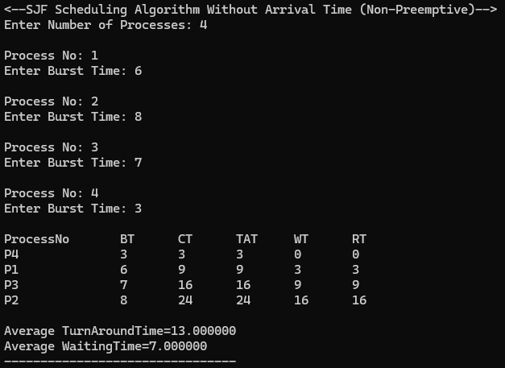

# 🧠 SJF (Shortest Job First) Scheduling - Non-Preemptive

Program ini mengimplementasikan algoritma **Shortest Job First (SJF)** dengan pendekatan **Non-Preemptive** menggunakan bahasa C.  
SJF Non-Preemptive menjadwalkan proses berdasarkan waktu burst terkecil, dan proses yang sedang berjalan tidak dapat dihentikan oleh proses lain yang datang.

---

## 📋 Deskripsi Algoritma

- **SJF Non-Preemptive** mengeksekusi proses berdasarkan waktu burst yang paling kecil terlebih dahulu.
- Tidak menggunakan arrival time (diasumsikan semua proses datang bersamaan).
- Setelah proses mulai berjalan, ia akan menyelesaikan eksekusinya tanpa gangguan (*non-preemptive*).
- Cocok digunakan untuk sistem batch di mana semua proses telah diketahui sebelumnya.

---

## 🧾 Code
```c
#include<stdio.h>
struct proc
{
    int no,bt,ct,tat,wt;
};
struct proc read(int i)
{
    struct proc p;
    printf("\nProcess No: %d\n",i);
    p.no=i;
    printf("Enter Burst Time: ");
    scanf("%d",&p.bt);
    return p;
}
int main()
{
    struct proc p[10],tmp;
    float avgtat=0,avgwt=0;
    int n,ct=0;
    printf("<--SJF Scheduling Algorithm Without Arrival Time (Non-Preemptive)-->\n");
    printf("Enter Number of Processes: ");
    scanf("%d",&n);
    for(int i=0;i<n;i++)
        p[i]=read(i+1);
    for(int i=0;i<n-1;i++)
        for(int j=0;j<n-i-1;j++)    
            if(p[j].bt>p[j+1].bt)
            {
				tmp=p[j];
				p[j]=p[j+1];
				p[j+1]=tmp;
            }
    printf("\nProcessNo\tBT\tCT\tTAT\tWT\tRT\n");
    for(int i=0;i<n;i++)
    {
        ct+=p[i].bt;
		p[i].ct=p[i].tat=ct;
		avgtat+=p[i].tat;
        p[i].wt=p[i].tat-p[i].bt;
        avgwt+=p[i].wt;
        printf("P%d\t\t%d\t%d\t%d\t%d\t%d\n",p[i].no,p[i].bt,p[i].ct,p[i].tat,p[i].wt,p[i].wt);
    }
    avgtat/=n,avgwt/=n;
    printf("\nAverage TurnAroundTime=%f\nAverage WaitingTime=%f",avgtat,avgwt);
}
```

## 🧾 Contoh Input

Program akan meminta jumlah proses dan waktu burst untuk masing-masing proses.  
Contoh input:

Masukkan jumlah proses: 4

Masukkan burst time:
P1 = 6
P2 = 8
P3 = 7
P4 = 3


---

## 📊 Hasil Output Program

| Process | Burst Time (BT) | Completion Time (CT) | Turn Around Time (TAT) | Waiting Time (WT) | Response Time (RT) |
|---------|------------------|-----------------------|--------------------------|--------------------|---------------------|
| P4      | 3                | 3                     | 3                        | 0                  | 0                   |
| P1      | 6                | 9                     | 9                        | 3                  | 3                   |
| P3      | 7                | 16                    | 16                       | 9                  | 9                   |
| P2      | 8                | 24                    | 24                       | 16                 | 16                  |

📌 **Rumus:**
- `CT` (Completion Time) = waktu proses selesai
- `TAT` (Turn Around Time) = CT - Arrival Time (karena arrival time = 0, maka TAT = CT)
- `WT` (Waiting Time) = TAT - Burst Time
- `RT` (Response Time) = waktu mulai proses - Arrival Time = WT

---



## 🕒 Gantt Chart Eksekusi

Berikut adalah diagram Gantt Chart untuk penjadwalan berdasarkan burst time terkecil:

```mermaid
gantt
    title Gantt Chart - SJF Non-Preemptive
    dateFormat  x
    axisFormat  %L
    section Proses
    P4 : 0, 3
    P1 : 3, 6
    P3 : 9, 7
    P2 : 16, 8
```


# Catatan
- Algoritma ini efisien untuk proses batch tanpa arrival time.

- Namun, dapat menyebabkan kelaparan (starvation) untuk proses yang memiliki burst time besar.

- Cocok untuk sistem di mana semua proses telah diketahui sejak awal.

- Untuk sistem real-time, SJF Preemptive (SRTF) lebih direkomendasikan.

# 🧠 SJF (Shortest Job First) Scheduling - Non-Preemptive with Arrival Time

Program ini mengimplementasikan algoritma **Shortest Job First (SJF)** dengan pendekatan **Non-Preemptive** menggunakan bahasa **C** dan mempertimbangkan **Arrival Time** setiap proses.

---

## 📋 Deskripsi Algoritma

- **SJF Non-Preemptive** mengeksekusi proses berdasarkan burst time terkecil dari proses yang sudah datang (arrival time ≤ current time).
- Proses yang sedang berjalan tidak dapat dihentikan oleh proses lain.
- Lebih realistis dibanding versi tanpa arrival time.
- Cocok digunakan untuk simulasi penjadwalan CPU dalam sistem operasi.

---

## 📦 Fitur Program

- Input arrival time dan burst time untuk setiap proses.
- Menjadwalkan proses berdasarkan burst time terpendek yang tersedia saat itu.
- Menghitung:
  - Completion Time (CT)
  - Turnaround Time (TAT)
  - Waiting Time (WT)
  - Response Time (RT)
- Menghitung rata-rata TAT dan WT.

---

## 🧾 Source Code
```c
#include<stdio.h>
struct proc
{
    int no,at,bt,it,ct,tat,wt;
};
struct proc read(int i)
{
    struct proc p;
    printf("\nProcess No: %d\n",i);
    p.no=i;
    printf("Enter Arrival Time: ");
    scanf("%d",&p.at);
    printf("Enter Burst Time: ");
    scanf("%d",&p.bt);
    return p;
}
int main()
{
    int n,j,min=0;
    float avgtat=0,avgwt=0;
    struct proc p[10],temp;

    printf("<--SJF Scheduling Algorithm (Non-Preemptive)-->
");
    printf("Enter Number of Processes: ");
    scanf("%d",&n);

    for(int i=0;i<n;i++)
        p[i]=read(i+1);

    for(int i=0;i<n-1;i++)
        for(j=0;j<n-i-1;j++)
            if(p[j].at > p[j+1].at)
            {
                temp = p[j];
                p[j] = p[j+1];
                p[j+1] = temp;
            }

    for(j=1; j<n && p[j].at==p[0].at; j++)
        if(p[j].bt < p[min].bt)
            min = j;

    temp = p[0];
    p[0] = p[min];
    p[min] = temp;

    p[0].it = p[0].at;
    p[0].ct = p[0].it + p[0].bt;

    for(int i=1; i<n; i++)
    {
        for(j=i+1,min=i; j<n && p[j].at <= p[i-1].ct; j++)
            if(p[j].bt < p[min].bt)
                min = j;

        temp = p[i];
        p[i] = p[min];
        p[min] = temp;

        if(p[i].at <= p[i-1].ct)
            p[i].it = p[i-1].ct;
        else
            p[i].it = p[i].at;

        p[i].ct = p[i].it + p[i].bt;
    }

    printf("\nProcess\t\tAT\tBT\tCT\tTAT\tWT\tRT\n");
    for(int i=0;i<n;i++)
    {
        p[i].tat = p[i].ct - p[i].at;
        avgtat += p[i].tat;
        p[i].wt = p[i].tat - p[i].bt;
        avgwt += p[i].wt;
        printf("P%d\t\t%d\t%d\t%d\t%d\t%d\t%d\n", p[i].no, p[i].at, p[i].bt, p[i].ct, p[i].tat, p[i].wt, p[i].wt);
    }

    avgtat /= n;
    avgwt /= n;

    printf("\nAverage Turnaround Time = %.2f", avgtat);
    printf("\nAverage Waiting Time    = %.2f\n", avgwt);

    return 0;
}
```

---

## 📥 Contoh Input
```plaintext
Enter Number of Processes: 4

Process No: 1
Enter Arrival Time: 0
Enter Burst Time: 6

Process No: 2
Enter Arrival Time: 2
Enter Burst Time: 8

Process No: 3
Enter Arrival Time: 4
Enter Burst Time: 7

Process No: 4
Enter Arrival Time: 5
Enter Burst Time: 3
```

---

## 📊 Contoh Hasil Output

| Process | AT | BT | CT | TAT | WT | RT |
|---------|----|----|----|-----|----|----|
| P1      | 0  | 6  | 6  | 6   | 0  | 0  |
| P4      | 5  | 3  | 9  | 4   | 1  | 1  |
| P3      | 4  | 7  | 16 | 12  | 5  | 5  |
| P2      | 2  | 8  | 24 | 22  | 14 | 14 |

📌 **Rumus Perhitungan:**
- **CT** = IT + BT
- **TAT** = CT - AT
- **WT** = TAT - BT
- **RT** = IT - AT = WT (karena non-preemptive)

---


## 🕒 Gantt Chart

```mermaid
gantt
    title Gantt Chart - SJF Non-Preemptive with Arrival Time
    dateFormat  x
    axisFormat  %L
    section Proses
    P1 : 0, 6
    P4 : 6, 3
    P3 : 9, 7
    P2 : 16, 8
```



---

## Catatan

- Algoritma ini efektif untuk sistem di mana arrival time diketahui dan proses tidak terganggu.
- Namun, bisa terjadi *starvation* jika proses pendek terus-menerus datang.


# SRTF Scheduling Algorithm (Preemptive)

Program ini mengimplementasikan algoritma penjadwalan proses **SRTF (Shortest Remaining Time First)** yang bersifat preemptive. Algoritma ini memilih proses dengan waktu sisa (remaining time) eksekusi terkecil untuk dijalankan berikutnya. Proses yang sedang berjalan dapat diganggu jika ada proses lain yang datang dengan waktu sisa lebih kecil.

---

## Cara Kerja Program

1. Input jumlah proses.
2. Untuk setiap proses, input waktu kedatangan (Arrival Time) dan waktu eksekusi (Burst Time).
3. Algoritma SRTF memilih proses dengan remaining time terkecil yang sudah tiba untuk dijalankan setiap satuan waktu.
4. Proses yang berjalan dapat dihentikan (preempted) jika muncul proses baru dengan waktu sisa lebih kecil.
5. Output menampilkan Completion Time (CT), Turn Around Time (TAT), dan Waiting Time (WT) untuk setiap proses.
6. Menghitung rata-rata TAT dan WT.

---

## Contoh Input dan Output

```
<--SRTF Scheduling Algorithm (Preemptive)-->
Enter Number of Processes: 4

Process No: 1
Enter Arrival Time: 0
Enter Burst Time: 8

Process No: 2
Enter Arrival Time: 1
Enter Burst Time: 4

Process No: 3
Enter Arrival Time: 2
Enter Burst Time: 9

Process No: 4
Enter Arrival Time: 3
Enter Burst Time: 5

Process		AT	BT	CT	TAT	WT
P2		1	4	5	4	0
P4		3	5	10	7	2
P1		0	8	17	17	9
P3		2	9	26	24	15

Average TurnAroundTime=13.000000
Average WaitingTime=6.500000
```

---

## Source Code (C)

```c
#include<stdio.h>
#define MAX 9999

struct proc {
    int no, at, bt, rt, ct, tat, wt;
};

struct proc read(int i) {
    struct proc p;
    printf("\nProcess No: %d\n", i);
    p.no = i;
    printf("Enter Arrival Time: ");
    scanf("%d", &p.at);
    printf("Enter Burst Time: ");
    scanf("%d", &p.bt);
    p.rt = p.bt;
    return p;
}

int main() {
    struct proc p[10], temp;
    float avgtat = 0, avgwt = 0;
    int n, s, remain = 0, time;

    printf("<--SRTF Scheduling Algorithm (Preemptive)-->
");
    printf("Enter Number of Processes: ");
    scanf("%d", &n);

    for (int i = 0; i < n; i++)
        p[i] = read(i + 1);

    // Sort by arrival time
    for (int i = 0; i < n - 1; i++)
        for (int j = 0; j < n - i - 1; j++)
            if (p[j].at > p[j + 1].at) {
                temp = p[j];
                p[j] = p[j + 1];
                p[j + 1] = temp;
            }

    printf("\nProcess\t\tAT\tBT\tCT\tTAT\tWT\n");

    p[9].rt = MAX; // Sentinel for comparison

    for (time = 0; remain != n; time++) {
        s = 9;
        for (int i = 0; i < n; i++)
            if (p[i].at <= time && p[i].rt < p[s].rt && p[i].rt > 0)
                s = i;

        p[s].rt--;

        if (p[s].rt == 0) {
            remain++;
            p[s].ct = time + 1;
            p[s].tat = p[s].ct - p[s].at;
            avgtat += p[s].tat;
            p[s].wt = p[s].tat - p[s].bt;
            avgwt += p[s].wt;
            printf("P%d\t\t%d\t%d\t%d\t%d\t%d\n", p[s].no, p[s].at, p[s].bt, p[s].ct, p[s].tat, p[s].wt);
        }
    }

    avgtat /= n;
    avgwt /= n;
    printf("\nAverage TurnAroundTime=%f\nAverage WaitingTime=%f\n", avgtat, avgwt);
}
```

---

## Contoh Gantt Chart (Mermaid)

```mermaid
gantt
    title Gantt Chart - SRTF Preemptive
    dateFormat  X
    axisFormat  %L

    section Proses
    P1 : 0, 1
    P2 : 1, 4
    P4 : 5, 5
    P1 : 10, 7
    P3 : 17, 9
```



---
## Catatan
- Algoritma ini efektif untuk sistem di mana arrival time diketahui dan proses tidak terganggu.

- Namun, bisa terjadi starvation jika proses pendek terus-menerus datang.